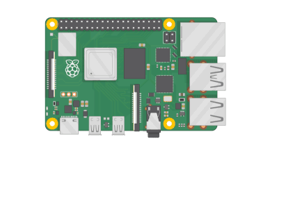

# Ball Tracking Robot:

I chose the Ball Tracking Robot as my main project. It uses a computer vision Python library called OpenCv to detect if the ball is present within the camera frame, and then it controls motors and navigates the robot towards the ball. The robot uses a Raspberry Pi minicomputer, cameras, DC motors, and ultrasonic sensors to detect objects that might cause a crash.

| **Engineer** | **School** | **Area of Interest** | **Grade** |
|:--:|:--:|:--:|:--:|
| William L | Monta Vista High School | Computer Science | Incoming Sophomore

.jpg)

# Second Milstone:

**Summary:**
For my second milestone, I implemented the camera and the color detection portion of my project, allowing the robot to see the red color of the ball using OpenCV. Also, I added ultrasonic sensors on the front of the robot to detect if it is too close to the ball or any other object.

**How it Works:**
If the camera detects blobs of red pixels with area greater than 20000 square pixels and less than 100000 square pixels. If one is found,  it will move forward until the area of the ball is greater than 200000 or an ultrasonic sensor detects a distance less than 7 cm. In which case, it will move backwards.

```python
def find_red(frame):
    hsv_roi = cv2.cvtColor(frame, cv2.COLOR_BGR2HSV)
    
    lower_red1 = np.array([150, 140, 1])
    upper_red1 = np.array([190, 255, 255])
    
    mask1 = cv2.inRange(hsv_roi, lower_red1, upper_red1)
    
    mask = mask1
    mask = cv2.erode(mask, np.ones((3, 3), np.uint8))
    mask = cv2.dilate(mask, np.ones((8, 8), np.uint8))
    
    cv2.imshow('mask', mask)  
    return mask
```

The function above isolates the red pixels detected by the camera, and returns a mask of the original video that has white pixels where the red is and black everywhere else. The lower_red1 and upper_red1 variables are the range of red colors that we want to detect. The cv2.inRange() function isolates the range of red colors in the frame. When cv2.erode() and cv2.dilate() are used together, they help to remove small objects from the foreground and smooth out larger objects, allowing for a more refined image.

```python
def find_blob(blob):
    largest_contour = 0
    cont_idx = 0
    contours, hierarchy = cv2.findContours(blob,  cv2.RETR_CCOMP, cv2.CHAIN_APPROX_SIMPLE)

    for idx, contour in enumerate(contours):
        area=cv2.contourArea(contour)
        if (area >largest_contour) :
            largest_contour=area
            cont_index=idx
                    
    r=(0,0,2,2)
    
    if len(contours) > 0:
        r = cv2.boundingRect(contours[cont_index])
     
    return r,largest_contour
```

This function actually finds the blob of white pixels from the mask that the find_red function returns. The input is the mask of the red pixels, and it returns r, the bounding rectangle of the contour, (x, y, w, h). (x, y) is the top left corner, and (w, h) is the width and height of the rectangle. largest_contour is the area of the largest contour found in the image.

```python
def find_distance(trig, echo):
    start = 0
    stop = 0
	
    GPIO.setup(trig, GPIO.OUT)
    GPIO.setup(echo, GPIO.IN)
	
    GPIO.output(trig, GPIO.LOW)
    time.sleep(0.01)

    GPIO.output(trig, GPIO.HIGH)
    time.sleep(0.00001)
    GPIO.output(trig, GPIO.LOW)
    begin = time.time()
    while GPIO.input(echo) == 0 and time.time() < begin + 0.05:
        start = time.time()
    while GPIO.input(echo) == 1 and time.time() < begin + 0.1:
        stop = time.time()

    elapsed = stop - start
    distance = elapsed * 34300
    distance = distance / 2
    distance = round(distance, 2)

    return distance
```

This function returns the distance detected in an ultrasonic sensor given the trigger and echo pins on the raspberry pi. It sets the output of the sensor to high for a very short amount of time, allowing it to emit an ultrasound signal. “start” and “stop” keep track of when the echo receives a signal. The elapsed time is multiplied by 34300 and divided by two to account for the speed of sound and because the signal hits the object and travels back.


This is a diagram of an HC-SR04 sensor. The cylinder object on the left transmits the signals and the one on the right receives the signals. VCC and GND connect to power and ground respectively, and Trig and Echo are connected to pins on the raspberry pi. When Trig is set to HIGH, it emits the ultrasonic sound pulses. Echo is set to an input pin, so when it receives the signal, it will emit a pulse. 

**Parts Used:**
- Raspberry Pi camera module: A 12 megapixel camera that is compatible with Raspberry Pi 4
- HC-SR04 sensors: Ultrasonic sensors used to detect distances of unwanted objects
- Breadboard: Connecting all the components together and supplying power to all three ultrasonic sensors.

**Challenges:**
I spent almost a whole day trying to figure out what was wrong with one of the ultrasonic sensors, only to realize that it was burned out, and by simply replacing it, I solved the issue. Additionally, the template code was outdated, and I needed to use a library named picamera2 to achieve the same effect. 

**What's Next:**
After this, I will put all my code together and allow the robot to indefinitely search for the ball.

# First Milestone:

<iframe width="560" height="315" src="https://www.youtube.com/embed/nw1HndpI-dI?si=KehLbm4MAK9ZHV8J" title="YouTube video player" frameborder="0" allow="accelerometer; autoplay; clipboard-write; encrypted-media; gyroscope; picture-in-picture; web-share" referrerpolicy="strict-origin-when-cross-origin" allowfullscreen></iframe>

**Summary:**
For my first milestone, I made the robot move forward and turn on command. First, I built the frame for my robot, attaching the wheels and motors to the base. Second, I connected the L298H Driver Board, the DC Motors, and the Raspberry Pi. Lastly, I wrote testing code on the Raspberry Pi to make the robot move forward and turn.

**How it Works:**
The Raspberry Pi is the central controller of the whole project. It sends command signals to the L298H Driver Board, which controls the DC Motors. Each input pin on the L298H Driver Board is connected to a General Purpose Input Output (GPIO) pin on the Raspberry Pi, and the output pins are soldered to the DC Motors. In my code, I specify which pins I want to run GPIO operations on, and these are the pins controlling the Driver Board. This way, I can control the motors using the raspberry pi.

```python
# Left Motor
in1 = 17 # Forward 
in2 = 27 # Backward
ena = 4

# Right Motor
in3 = 2 # Foward 
in4 = 3 # Backward
enb = 14

# GPIO Setup
GPIO.setup(in1, GPIO.OUT)
GPIO.setup(in2, GPIO.OUT)
GPIO.setup(ena, GPIO.OUT)
```

This code specifies which GPIO pins the L298H driver board is connected to, and which pins correspond to which motors. GPIO pins are general purpose, meaning that they need setup code and need to be defined as either input or output. In the above code, I specify the in1, in2, and ena pins as output pins. in1 and in2 control the right motor.. in3 and in4 control the right motor.

```python
def forward():
    GPIO.output(in1, GPIO.HIGH)
    GPIO.output(in2, GPIO.LOW)
    
    GPIO.output(in3, GPIO.HIGH)
    GPIO.output(in4, GPIO.LOW)
```

Here, I defined a forward function, which makes the robot move forward. GPIO.HIGH and GPIO.LOW specify how the motor is to move, and combinations of these commands can make it move in other ways. in1 and in2 are connected to the out1 and out2 pins on the driver board. One is set to high and one is set to low, so 5V of current comes out. ena and enb are configured to be pwm pins, which stands for pulse width modulation. PWM is useful for controlling the average power or amplitude delivered by an electrical signal. After this configuration, each pin outputs a waveform with a certain frequency. This changes how fast the motors turn.


This is a diagram of an H-bridge configuration, which is commonly used to control DC Motors. Q1, Q2, Q3, and Q4 are switches that control current flow. The H-bridge configuration, with its four switches, allows you to control the direction of the motor by selectively turning on pairs of transistors. For example, in my project, when I want the robot to move forward, I would turn on switches Q1 and Q4, while leaving Q2 and Q3 off. 

**Parts Used:**
- Raspberry Pi 4: A small minicomputer that controls everything in this project. Wired everything to this and used it to control power to the motors.
- DC Motors: Two electrical motors that use Direct Current (DC) to produce mechanical force. Uses an electromagnet to change the direction of current in the motor.
- L298H Driver Board: A H-bridge motor driver board that is used to connect the Pi to the DC motors. A H-bridge is an electronic circuit that switches the polarity of a voltage.
- 6V Power Source: Supplies the L298H driver board with power. 
- Portable Battery Source: Supplies the Raspberry Pi with power.


.jpg)

Left: Raspberry Pi 4, Right: L298H Driver Board

**Challenges:**
When completing this milestone, I faced a number of challenges. Firstly, connecting the Raspberry Pi to my computer took a whole day of trial and error until it finally connected. Additionally, the wiring was a challenge. It took me a while to find out which output and input pins on the L298H Driver Board corresponded with which motor. After I finished these tasks, writing code was much simpler. 

**What’s Next:**
After this, I will work on the color detection and ball tracking component of this project, and this seems like more coding, which I am looking forward to. 


Ultrasonic sensor 1:
- TRIG to GPIO 23
- ECHO to GPIO 24
Ultrasonic sensor 2:
- TRIG to GPIO 16
- ECHO to GPIO 26
Ultrasonic sensor 3:
- TRIG to GPIO 5
- ECHO to GPIO 6:

H-bridge:
- IN1 to GPIO 17
- IN2 to GPIO 27
- ENA to GPIO 4
- IN3 to GPIO 2 
- IN4 to GPIO 3
- ENB to GPIO 14

# Code:

**First Milestone Code:**

```python
import RPi.GPIO as GPIO
import cv2
import numpy as np
from time import sleep

GPIO.setwarnings(False)

# Left Motor
in1 = 17 # Forward 
in2 = 27 # Backward
ena = 4

# Right Motor
in3 = 2 # Foward 
in4 = 3 # Backward
enb = 14

GPIO.setmode(GPIO.BCM)

GPIO.setup(in1, GPIO.OUT)
GPIO.setup(in2, GPIO.OUT)
GPIO.setup(ena, GPIO.OUT)

GPIO.setup(in3, GPIO.OUT)
GPIO.setup(in4, GPIO.OUT)
GPIO.setup(enb, GPIO.OUT)

power_a = GPIO.PWM(ena, 20)
power_a.start(60)

power_b = GPIO.PWM(enb, 20)
power_b.start(60)

def forward():
    GPIO.output(in1, GPIO.HIGH)
    GPIO.output(in2, GPIO.LOW)
    
    GPIO.output(in3, GPIO.HIGH)
    GPIO.output(in4, GPIO.LOW)

def stop():
    GPIO.output(in1, GPIO.LOW)
    GPIO.output(in2, GPIO.LOW)
    
    GPIO.output(in3, GPIO.LOW)
    GPIO.output(in4, GPIO.LOW)
    
def turn_left():
    GPIO.output(in1, GPIO.LOW)
    GPIO.output(in2, GPIO.HIGH)
    
    GPIO.output(in3, GPIO.HIGH)
    GPIO.output(in4, GPIO.LOW)
    
def turn_right():
    GPIO.output(in1, GPIO.HIGH)
    GPIO.output(in2, GPIO.LOW)
    
    GPIO.output(in3, GPIO.LOW)
    GPIO.output(in4, GPIO.HIGH)
    

while(True):
	userInput = input()
	
	if (userInput == 'c'):
		forward()
	if (userInput == 'l'):
		turn_left()
	if (userInput == 'r'):
		turn_right()
	if (userInput == 'x'):
		stop()

```

# Starter Project: Calculator:

<iframe width="560" height="315" src="https://www.youtube.com/embed/q9Mwomvro4c?si=zozlNiDIa9Zl9xtW" title="YouTube video player" frameborder="0" allow="accelerometer; autoplay; clipboard-write; encrypted-media; gyroscope; picture-in-picture; web-share" referrerpolicy="strict-origin-when-cross-origin" allowfullscreen></iframe>

**Summary:**
For my starter project, I chose to make a calculator. It is a simple four function calculator that can use decimals and goes up to six digits. This project involved a lot of soldering and connecting parts, and it was pretty challenging and took a lot of time.

**Parts used:**
- Monolithic Capacitor: Used for energy exchange and storage
- 3V Battery: Power supply of the calculator
- Buttons and Button Caps: Detects presses and sends signals to the STC controller
- Seven Segment Displays: Allows numbers to be displayed
- STC Controller: Microchip, performs operations fast and using little power
- Circuit board: Allows the connections to be possible
- Screws and Nuts: Fastens the parts together

**How it Works:**
The STC Controller has many small pins attached to the sides, and whenever a button is pressed, it sends a signal to one of the pins. Depending on which pins are on and which pins are off, the STC Controller will send a different signal to the seven segment displays and display your operations. A seven segment display allows numbers to be displayed by controlling current flow to each of seven segments, allowing many combinations of patterns to be displayed.


(forum.arduino.cc)

This is a diagram of a seven segment display. Each switch (lettered A-DP) controls the corresponding segment on the display by allowing current to flow to that segment.

**Challenges:**
Despite this being a starter project, it still came with many challenges. Firstly, the large number of components that needed connecting required a lot of very precise soldering, which was a challenge. Additionally, the instructions were rather unclear, and I spent quite a long time figuring out which parts to solder and how to connect them. 

**What's Next:**
After completing my start project, I will start planning my main project.


<!--
# Ball Tracking Robot
<!--Replace this text with a brief description (2-3 sentences) of your project. This description should draw the reader in and make them interested in what you've built. You can include what the biggest challenges, takeaways, and triumphs from completing the project were. As you complete your portfolio, remember your audience is less familiar than you are with all that your project entails!-->

<!-- You should comment out all portions of your portfolio that you have not completed yet, as well as any instructions: -->
<!--- This is an HTML comment in Markdown -->
<!--- Anything between these symbols will not render on the published site -->
<!--
| **Engineer** | **School** | **Area of Interest** | **Grade** |
|:--:|:--:|:--:|:--:|
| William L | Monta Vista High School | Computer Science | Incoming Sophomore

**Replace the BlueStamp logo below with an image of yourself and your completed project. Follow the guide [here](https://tomcam.github.io/least-github-pages/adding-images-github-pages-site.html) if you need help.**


  
# Final Milestone

**Don't forget to replace the text below with the embedding for your milestone video. Go to Youtube, click Share -> Embed, and copy and paste the code to replace what's below.**

<iframe width="560" height="315" src="https://www.youtube.com/embed/F7M7imOVGug" title="YouTube video player" frameborder="0" allow="accelerometer; autoplay; clipboard-write; encrypted-media; gyroscope; picture-in-picture; web-share" allowfullscreen></iframe>

For your final milestone, explain the outcome of your project. Key details to include are:
- What you've accomplished since your previous milestone
- What your biggest challenges and triumphs were at BSE
- A summary of key topics you learned about
- What you hope to learn in the future after everything you've learned at BSE


# Second Milestone

**Don't forget to replace the text below with the embedding for your milestone video. Go to Youtube, click Share -> Embed, and copy and paste the code to replace what's below.**

<iframe width="560" height="315" src="https://www.youtube.com/embed/y3VAmNlER5Y" title="YouTube video player" frameborder="0" allow="accelerometer; autoplay; clipboard-write; encrypted-media; gyroscope; picture-in-picture; web-share" allowfullscreen></iframe>

For your second milestone, explain what you've worked on since your previous milestone. You can highlight:
- Technical details of what you've accomplished and how they contribute to the final goal
- What has been surprising about the project so far
- Previous challenges you faced that you overcame
- What needs to be completed before your final milestone 

# First Milestone

**Don't forget to replace the text below with the embedding for your milestone video. Go to Youtube, click Share -> Embed, and copy and paste the code to replace what's below.**

<iframe width="560" height="315" src="https://www.youtube.com/embed/CaCazFBhYKs" title="YouTube video player" frameborder="0" allow="accelerometer; autoplay; clipboard-write; encrypted-media; gyroscope; picture-in-picture; web-share" allowfullscreen></iframe>

For your first milestone, describe what your project is and how you plan to build it. You can include:
- An explanation about the different components of your project and how they will all integrate together
- Technical progress you've made so far
- Challenges you're facing and solving in your future milestones
- What your plan is to complete your project

# Schematics 
Here's where you'll put images of your schematics. [Tinkercad](https://www.tinkercad.com/blog/official-guide-to-tinkercad-circuits) and [Fritzing](https://fritzing.org/learning/) are both great resoruces to create professional schematic diagrams, though BSE recommends Tinkercad becuase it can be done easily and for free in the browser. 

# Code
Here's where you'll put your code. The syntax below places it into a block of code. Follow the guide [here]([url](https://www.markdownguide.org/extended-syntax/)) to learn how to customize it to your project needs. 

```c++
void setup() {
  // put your setup code here, to run once:
  Serial.begin(9600);
  Serial.println("Hello World!");
}

void loop() {
  // put your main code here, to run repeatedly:

}
```

# Bill of Materials
Here's where you'll list the parts in your project. To add more rows, just copy and paste the example rows below.
Don't forget to place the link of where to buy each component inside the quotation marks in the corresponding row after href =. Follow the guide [here]([url](https://www.markdownguide.org/extended-syntax/)) to learn how to customize this to your project needs. 

| **Part** | **Note** | **Price** | **Link** |
|:--:|:--:|:--:|:--:|
| Item Name | What the item is used for | $Price | <a href="https://www.amazon.com/Arduino-A000066-ARDUINO-UNO-R3/dp/B008GRTSV6/"> Link </a> |
| Item Name | What the item is used for | $Price | <a href="https://www.amazon.com/Arduino-A000066-ARDUINO-UNO-R3/dp/B008GRTSV6/"> Link </a> |
| Item Name | What the item is used for | $Price | <a href="https://www.amazon.com/Arduino-A000066-ARDUINO-UNO-R3/dp/B008GRTSV6/"> Link </a> |

# Other Resources/Examples
One of the best parts about Github is that you can view how other people set up their own work. Here are some past BSE portfolios that are awesome examples. You can view how they set up their portfolio, and you can view their index.md files to understand how they implemented different portfolio components.
- [Example 1](https://trashytuber.github.io/YimingJiaBlueStamp/)
- [Example 2](https://sviatil0.github.io/Sviatoslav_BSE/)
- [Example 3](https://arneshkumar.github.io/arneshbluestamp/)

To watch the BSE tutorial on how to create a portfolio, click here. -->
