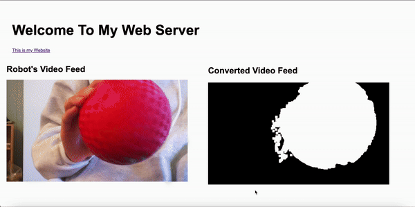

# Ball Tracking Robot:

I chose the Ball Tracking Robot as my main project. It uses a computer vision Python library called OpenCv to detect if the ball is present within the camera frame, and then it controls motors and navigates the robot towards the ball. The robot uses a Raspberry Pi minicomputer, cameras, DC motors, and ultrasonic sensors to detect objects that might cause a crash.

| **Engineer** | **School** | **Area of Interest** | **Grade** |
|:--:|:--:|:--:|:--:|
| William L | Monta Vista High School | Computer Science | Incoming Sophomore

.jpg)

# Second Modification:

**Summary:** 
For this modification, I created a web server on my Raspberry Pi using apache2 and html, and streamed the video captured by the PiCam to the website. 



**How It works:**
First, I created a web server on my Raspberry Pi using apache2. Apache2 is a commonly used software that allows a Raspberry Pi to serve web pages, and allows users to access them. In order to stream video, I used another python library called flask. Flask is one of the most popular python based web frameworks, and allows users to create lightweight web applications quickly and easily. I used various flask functions to create python code to render an html file that I wrote that takes video from the PiCamera and streams it onto the website.
```python
def generate_frames2():
    while True:
        frame = picam.capture_array()
        red = find_red(frame)
        cv2.rectangle(red, (x,y), (x+w,y+h), 255,2)
        cv2.circle(red,(int(center_x),int(center_y)),3,(0,110,255),-1)
        ret, buffer = cv2.imencode('.jpg', red)
        mask = buffer.tobytes()
        yield (b'--mask\r\n'
               b'Content-Type: image/jpeg\r\n\r\n' + mask + b'\r\n')    
```
This code uses cv2 functions to convert the captured video into something readable by html. This allows for faster processing and better video
```python
@app.route('/video_feed_red')
def video_feed_stream2():
    return Response(generate_frames2(), mimetype='multipart/x-mixed-replace; boundary=mask')
```
This code creates a route of the web server, and it calls the generate_frames2 function to retrieve the video.
```html
<div style="width: 50%; height: 50%; float: right" >
    <h2 style="font-size: 30spx; font-weight: bold">Converted Video Feed</h1>
    
</div>
```
This is part of the html code that takes the video from the python functions. src="{{ url_for('video_feed_stream2') }}" specifies the source of the video, which is what the function video_feed_stream2() returns.

**Challenges:**
This modification was not an easy one, due to the many parts that were required to make it work. First of all, I had never used html or worked with web servers. After setting up the web server, I had to learn how to edit the contents using html. After this, I had to use flask, a completely new library, to stream the video. After I got this to work, I had to find a way to integrate the movement code into one of the streaming functions. This required a lot of tinkering with the code, which took a while.

# First Modification:

**Summary:**
My first modification was allowing the user to manually control the robot, and override it's automatic driving. I did this using MIT App Inventor, and an HC05 bluetooth module. Using MIT App Inventor, I created an app that allows the user to switch between manual and automatic modes, and gives them five movement functions, forward, reverse, turning left, turning right, and stopping. Also, the user can adjust the speed of the robot between three speeds, slow, medium, or fast.

**How It Works:**
The app is connected to the bluetooth module, which is connected to my Raspberry Pi. When a button is pressed, it sends a character through the bluetooth module to the Raspberry Pi. For example, if the forward button was pressed, it would send a "F". The raspberry Pi recieves these characters, and moves the motors accordingly. The default mode is automatic, but if the user presses manual or automatic mode, the robot will switch accordingly. 

```python
import serial

ser = serial.Serial(
    port='/dev/serial0',  
    baudrate=9600,        
    timeout=1             
)

while True:
    if ser.in_waiting > 0:
        received_data = ser.read().decode('utf-8')
    if received_data == "A":
	automatic = True
	#print("Automatic")
    elif received_data == "M":
	automatic = False
	#print("Manual")
```
This code uses the package pyserial, and configures the serial port to match the hc05 bluetooth module. It uses the port '/dev/serial0', which is often used with Raspberry Pis. Inside the while loop, if the port has received data, it will extract the first character. Depending on what that character is, the robot will perform the desired action. For example, if it receives an "A", it will be set to automatic mode, and the robot will ignore any other data sent at it. Conversely, if it receives an "M", it will be set to manual mode, and the robot will listen and react to any data sent to it.


.png)

This is my app on MIT app inventor, and the code blocks that go with it. The code block at the top allow the user to choose a bluetooth device, and connect to it. When the buttons are pressed, they send a character to the bluetooth connection. For example, Button 1 is the forward button, so if that is pressed, an "F" will be sent to the Pi, and the robot will move forward. See this video for reference: <a href="https://www.youtube.com/watch?v=vn5UicsOT3Q&t=767s"> <ins>Link</ins> </a> 

**Challenges:**
Originally, instead of the five movement buttons, I wanted to let the user move the robot using a joystick. However, after doing some research, I felt that it was too difficult to create on a simple app maker like MIT App Inventor, so I just opted to make the movement buttons. Additionally, connecting the HC-05 to my phone proved to be a bigger challenge than expected. It would not pair effectively until I forgot the device and re-paired it.

**What's Next:**
After this, I plan to add a second modification to my project, but I have not decided what to add yet.


*wire the remaining two ultrasonic sensors similarly <br>
This is the final schematic, including the bluetooth modification.

# Third Milestone:

<iframe width="560" height="315" src="https://www.youtube.com/embed/nhkigA_j5tA?si=g1DcOc967T06zs54" title="YouTube video player" frameborder="0" allow="accelerometer; autoplay; clipboard-write; encrypted-media; gyroscope; picture-in-picture; web-share" referrerpolicy="strict-origin-when-cross-origin" allowfullscreen></iframe>

**Summary:**
For my third milestone, I completed my project, allowing the robot to infinitely search for the ball.

**How It Works:**
This milestone was mostly a coding milstone, basically joining together all the systems that I created in the past milstones. I allowed the robot to move based on the input from the camera and the ultrasonic sensors.

```python
while True:
    video = picam.capture_array()
    red_pixels = find_red(video)
    loct, area = find_blob(red_pixels)
    x, y, w, h = loct

    left = find_distance(TRIG_L, ECHO_L)
    center = find_distance(TRIG_C, ECHO_C)
    right = find_distance(TRIG_R, ECHO_R)
    min_distance = min(left, center, right)
    area = w*h
    print("area:", area, "center x:", center_x, "center y:", center_y)
    
    simg2 = cv2.rectangle(red_pixels, (x,y), (x+w,y+h), 255,2)
    cv2.circle(red_pixels,(int(center_x),int(center_y)),3,(0,110,255),-1)
    cv2.imshow('mask', red_pixels)
    if area > 200000 or min_distance < 7:
        print("object too close, reversing")
        reverse()
    elif 20000 < area and area < 100000:
        center_x = x + (w)/2
        center_y = y + (h)/2
        forward()
        print("ball found, moving forward")
    elif 100000 < area and area < 200000:
        print("ball found, stopped")
        stop() 
    elif center_x > right_range:
        print("ball not found, turning right")
        turn_right()
        time.sleep(0.2)
        stop()
    elif center_x < left_range:
        print("ball not found, turning left")
        turn_left()
        time.sleep(0.2)
        stop()
    else:
        stop()
        
    if cv2.waitKey(1) == ord('q'):
        break
        
cv2.destroyAllWindows()
```
This code is the main part of my project. Every time the loop runs, it captures the input from the camera, and uses the find_red() and find_blob() functions to process it and isolate the red pixels. The size of my frame is 640 pixels by 360 pixels, with an area of 230400 pixels. Then, it calculates the area of the red pixels found. It also takes the inputs from each ultrasonic sensor using the calculate_distance() function. If this area is greater than 200,000 pixels or if the minimum distance detected by the ultrasonic sensors is less than 7 cms, this means either the ball or another object is too close to the robot. In this case, it will move backwards to prevent collision. If the area of the red pixels is in between 20,000 pixels and 100,000 pixels, then the robot will move forward towards the ball. If the area is between 100,000 pixels and 200,000 pixels, then the robot will stop moving, and park in front of the ball. The code is also constantly tracking the center coordinates of the ball, and if these coordinates are less than a certain threshold or greater than a certain threshold, the robot will turn left or right until the ball is found. If none of these conditions are met, the robot will stop moving. 

**Challenges:**
Overall, this milestone was pretty smooth, but one thing that was challenging was figuring out which order to layer the if statements. Previously, if the ball was placed a certain position, the robot would move back and forth quickly. When I changed the order of the if statements, this did not happen anymore.

**What's Next:**
After this, I am going to brainstorm possible modifications I can make to make my project even better. Right now, I am thinking of implementing object detection to maybe track other objects, as well as perhaps attatching more hardware devices for more functionality.

# Second Milstone:

<iframe width="560" height="315" src="https://www.youtube.com/embed/3c_5SvEc2xs?si=PZL8ljuQCZalwna-" title="YouTube video player" frameborder="0" allow="accelerometer; autoplay; clipboard-write; encrypted-media; gyroscope; picture-in-picture; web-share" referrerpolicy="strict-origin-when-cross-origin" allowfullscreen></iframe>

**Summary:**
For my second milestone, I implemented the camera and the color detection portion of my project, allowing the robot to see the red color of the ball using OpenCV. Also, I added ultrasonic sensors on the front of the robot to detect if it is too close to the ball or any other object.

**How it Works:**
If the camera detects blobs of red pixels with area greater than 20000 square pixels and less than 100000 square pixels. If one is found,  it will move forward until the area of the ball is greater than 200000 or an ultrasonic sensor detects a distance less than 7 cm. In which case, it will move backwards.

```python
def find_red(frame):
    hsv_roi = cv2.cvtColor(frame, cv2.COLOR_BGR2HSV)
    
    lower_red1 = np.array([150, 140, 1])
    upper_red1 = np.array([190, 255, 255])
    
    mask1 = cv2.inRange(hsv_roi, lower_red1, upper_red1)
    
    mask = mask1
    mask = cv2.erode(mask, np.ones((3, 3), np.uint8))
    mask = cv2.dilate(mask, np.ones((8, 8), np.uint8))
    
    cv2.imshow('mask', mask)  
    return mask
```

The function above isolates the red pixels detected by the camera, and returns a mask of the original video that has white pixels where the red is and black everywhere else. The lower_red1 and upper_red1 variables are the range of red colors that we want to detect. The cv2.inRange() function isolates the range of red colors in the frame. When cv2.erode() and cv2.dilate() are used together, they help to remove small objects from the foreground and smooth out larger objects, allowing for a more refined image.

```python
def find_blob(blob):
    largest_contour = 0
    cont_idx = 0
    contours, hierarchy = cv2.findContours(blob,  cv2.RETR_CCOMP, cv2.CHAIN_APPROX_SIMPLE)

    for idx, contour in enumerate(contours):
        area=cv2.contourArea(contour)
        if (area >largest_contour) :
            largest_contour=area
            cont_index=idx
                    
    r=(0,0,2,2)
    
    if len(contours) > 0:
        r = cv2.boundingRect(contours[cont_index])
     
    return r,largest_contour
```

This function actually finds the blob of white pixels from the mask that the find_red function returns. The input is the mask of the red pixels, and it returns r, the bounding rectangle of the contour, (x, y, w, h). (x, y) is the top left corner, and (w, h) is the width and height of the rectangle. largest_contour is the area of the largest contour found in the image.

```python
def find_distance(trig, echo):
    start = 0
    stop = 0
	
    GPIO.setup(trig, GPIO.OUT)
    GPIO.setup(echo, GPIO.IN)
	
    GPIO.output(trig, GPIO.LOW)
    time.sleep(0.01)

    GPIO.output(trig, GPIO.HIGH)
    time.sleep(0.00001)
    GPIO.output(trig, GPIO.LOW)
    begin = time.time()
    while GPIO.input(echo) == 0 and time.time() < begin + 0.05:
        start = time.time()
    while GPIO.input(echo) == 1 and time.time() < begin + 0.1:
        stop = time.time()

    elapsed = stop - start
    distance = elapsed * 34300
    distance = distance / 2
    distance = round(distance, 2)

    return distance
```

This function returns the distance detected in an ultrasonic sensor (See Figure 1) given the trigger and echo pins on the raspberry pi. It sets the output of the sensor to high for a very short amount of time, allowing it to emit an ultrasound signal. “start” and “stop” keep track of when the echo receives a signal. The elapsed time is multiplied by 34300 and divided by two to account for the speed of sound and because the signal hits the object and travels back.


Figure 1: This is a diagram of an HC-SR04 sensor. The cylinder object on the left transmits the signals and the one on the right receives the signals. VCC and GND connect to power and ground respectively, and Trig and Echo are connected to pins on the raspberry pi. When Trig is set to HIGH, it emits the ultrasonic sound pulses. Echo is set to an input pin, so when it receives the signal, it will emit a pulse. Image Credit: <a href="https://docs.keyestudio.com/projects/KS3025/en/latest/Python_Windows/2.Projects/Project%2028%EF%BC%9AUltrasonic%20Ranger.html"> <ins>Link</ins> </a> 

**Parts Used:**
- Raspberry Pi camera module: A 12 megapixel camera that is compatible with Raspberry Pi 4
- HC-SR04 sensors: Ultrasonic sensors used to detect distances of unwanted objects
- Breadboard: Connecting all the components together and supplying power to all three ultrasonic sensors.

**Challenges:**
I spent almost a whole day trying to figure out what was wrong with one of the ultrasonic sensors, only to realize that it was burned out, and by simply replacing it, I solved the issue. Additionally, the template code was outdated, and I needed to use a library named picamera2 to achieve the same effect. 

**What's Next:**
After this, I will put all my code together and allow the robot to indefinitely search for the ball.

# First Milestone:

<iframe width="560" height="315" src="https://www.youtube.com/embed/nw1HndpI-dI?si=KehLbm4MAK9ZHV8J" title="YouTube video player" frameborder="0" allow="accelerometer; autoplay; clipboard-write; encrypted-media; gyroscope; picture-in-picture; web-share" referrerpolicy="strict-origin-when-cross-origin" allowfullscreen></iframe>

**Summary:**
For my first milestone, I made the robot move forward and turn on command. First, I built the frame for my robot, attaching the wheels and motors to the base. Second, I connected the L298H Driver Board, the DC Motors, and the Raspberry Pi. Lastly, I wrote testing code on the Raspberry Pi to make the robot move forward and turn.

**How it Works:**
The Raspberry Pi is the central controller of the whole project. It sends command signals to the L298H Driver Board, which controls the DC Motors. Each input pin on the L298H Driver Board is connected to a General Purpose Input Output (GPIO) pin on the Raspberry Pi, and the output pins are soldered to the DC Motors. In my code, I specify which pins I want to run GPIO operations on, and these are the pins controlling the Driver Board. This way, I can control the motors using the raspberry pi.

```python
# Left Motor
in1 = 17 # Forward 
in2 = 27 # Backward
ena = 4

# Right Motor
in3 = 2 # Foward 
in4 = 3 # Backward
enb = 14

# GPIO Setup
GPIO.setup(in1, GPIO.OUT)
GPIO.setup(in2, GPIO.OUT)
GPIO.setup(ena, GPIO.OUT)
```

This code specifies which GPIO pins the L298H driver board is connected to, and which pins correspond to which motors. GPIO pins are general purpose, meaning that they need setup code and need to be defined as either input or output. In the above code, I specify the in1, in2, and ena pins as output pins. in1 and in2 control the right motor. in3 and in4 control the right motor. (See Figure 1).

```python
def forward():
    GPIO.output(in1, GPIO.HIGH)
    GPIO.output(in2, GPIO.LOW)
    
    GPIO.output(in3, GPIO.HIGH)
    GPIO.output(in4, GPIO.LOW)
```

Here, I defined a forward function, which makes the robot move forward. GPIO.HIGH and GPIO.LOW specify how the motor is to move, and combinations of these commands can make it move in other ways. in1 and in2 are connected to the out1 and out2 pins on the driver board. One is set to high and one is set to low, so 5V of current comes out. ena and enb are configured to be pwm pins, which stands for pulse width modulation. PWM is useful for controlling the average power or amplitude delivered by an electrical signal. After this configuration, each pin outputs a waveform with a certain frequency. This changes how fast the motors turn.


Figure 1: This is a diagram of an H-bridge configuration, which is commonly used to control DC Motors. Q1, Q2, Q3, and Q4 are switches that control current flow. The H-bridge configuration, with its four switches, allows you to control the direction of the motor by selectively turning on pairs of transistors. For example, in my project, when I want the robot to move forward, I would turn on switches Q1 and Q4, while leaving Q2 and Q3 off. 

**Parts Used:**
- Raspberry Pi 4: A small minicomputer that controls everything in this project. Wired everything to this and used it to control power to the motors (See Figure 1).
- DC Motors: Two electrical motors that use Direct Current (DC) to produce mechanical force. Uses an electromagnet to change the direction of current in the motor.
- L298H Driver Board: A H-bridge motor driver board that is used to connect the Pi to the DC motors. A H-bridge is an electronic circuit that switches the polarity of a voltage (See Figure 2).
- 6V Power Source: Supplies the L298H driver board with power. 
- Portable Battery Source: Supplies the Raspberry Pi with power.

 (1).png) .jpg)

Figure 1: Raspberry Pi 4. Image Credit: <a href="https://www.raspberrypi.com/products/raspberry-pi-4-model-b/"> <ins>Link</ins> </a> , Figure 2: L298H Driver Board. Image Credit: <a href="https://www.allaboutcircuits.com/technical-articles/difference-slow-decay-mode-fast-decay-mode-h-bridge-dc-motor-applications/"> <ins>Link</ins> </a> 

**Challenges:**
When completing this milestone, I faced a number of challenges. Firstly, connecting the Raspberry Pi to my computer took a whole day of trial and error until it finally connected. Additionally, the wiring was a challenge. It took me a while to find out which output and input pins on the L298H Driver Board corresponded with which motor. After I finished these tasks, writing code was much simpler. 

**What’s Next:**
After this, I will work on the color detection and ball tracking component of this project, and this seems like more coding, which I am looking forward to. 

# Code:

**Testing Code:**
<br>
<a href="https://github.com/welainom/BlueStamp-Engineering-William-Liu/blob/gh-pages/bluetoothtest.py"> Bluetooth Test</a>
<br>
<a href="https://github.com/welainom/BlueStamp-Engineering-William-Liu/blob/gh-pages/cameratest.py"> Camera Test</a>
<br>
<a href="https://github.com/welainom/BlueStamp-Engineering-William-Liu/blob/gh-pages/motortest.py"> Motor Test</a>
<br>
<a href="https://github.com/welainom/BlueStamp-Engineering-William-Liu/blob/gh-pages/ultrasonictest.py"> Ultrasonic Test</a>
<br>
<a href="https://github.com/welainom/BlueStamp-Engineering-William-Liu/blob/gh-pages/videotest.py"> Video Streaming Test</a>

**Final Code:**
```python
from flask import Flask, Response, render_template
import cv2
from picamera2 import Picamera2
import numpy as np
import time 
import serial
import RPi.GPIO as GPIO

app = Flask(__name__)

picam = Picamera2()
picam.preview_configuration.main.size = (640, 360)
picam.preview_configuration.main.format = "RGB888"
picam.preview_configuration.align()
picam.configure("preview")
picam.start()

#GPIO Setup
GPIO.setwarnings(False)
# Left Motor
in1 = 17 # Forward 
in2 = 27 # Backward
ena = 4
# Right Motor
in3 = 2 # Foward 
in4 = 3 # Backward
enb = 18

GPIO.setmode(GPIO.BCM)
GPIO.setup(in1, GPIO.OUT)
GPIO.setup(in2, GPIO.OUT)
GPIO.setup(ena, GPIO.OUT)
GPIO.setup(in3, GPIO.OUT)
GPIO.setup(in4, GPIO.OUT)
GPIO.setup(enb, GPIO.OUT)

power_a = GPIO.PWM(ena, 100)
power_a.start(60)

power_b = GPIO.PWM(enb, 100)
power_b.start(60)

TRIG_L = 23
ECHO_L = 24
TRIG_C = 16
ECHO_C = 26
TRIG_R = 5
ECHO_R = 6

GPIO.setup(TRIG_L, GPIO.OUT)
GPIO.setup(ECHO_L, GPIO.IN)
GPIO.setup(TRIG_C, GPIO.OUT)
GPIO.setup(ECHO_C, GPIO.IN)
GPIO.setup(TRIG_R, GPIO.OUT)
GPIO.setup(ECHO_R, GPIO.IN)

GPIO.output(TRIG_L, GPIO.LOW)
GPIO.output(TRIG_C, GPIO.LOW)
GPIO.output(TRIG_R, GPIO.LOW)
time.sleep(1)

ser = serial.Serial(
    port='/dev/serial0',
    baudrate=9600,        
    timeout=1             
)

def find_distance(trig, echo):
	start = 0
	stop = 0
	
	GPIO.setup(trig, GPIO.OUT)
	GPIO.setup(echo, GPIO.IN)
	
	GPIO.output(trig, GPIO.LOW)
	time.sleep(0.01)
	
	GPIO.output(trig, GPIO.HIGH)
	time.sleep(0.00001)
	GPIO.output(trig, GPIO.LOW)
	begin = time.time()
	while GPIO.input(echo) == 0 and time.time() < begin + 0.05:
		start = time.time()
	while GPIO.input(echo) == 1 and time.time() < begin + 0.1:
		stop = time.time()
	
	elapsed = stop - start
	distance = elapsed * 34300
	distance = distance / 2
	distance = round(distance, 2)
	
	return distance

def forward():
	GPIO.output(in1, GPIO.HIGH)
	GPIO.output(in2, GPIO.LOW)
	
	GPIO.output(in3, GPIO.HIGH)
	GPIO.output(in4, GPIO.LOW)

def reverse():
    GPIO.output(in1, GPIO.LOW)
    GPIO.output(in2, GPIO.HIGH)
    
    GPIO.output(in3, GPIO.LOW)
    GPIO.output(in4, GPIO.HIGH)

def stop():
    GPIO.output(in1, GPIO.LOW)
    GPIO.output(in2, GPIO.LOW)
    
    GPIO.output(in3, GPIO.LOW)
    GPIO.output(in4, GPIO.LOW)
    
def turn_left():
    GPIO.output(in1, GPIO.LOW)
    GPIO.output(in2, GPIO.HIGH)
    GPIO.output(in3, GPIO.HIGH)
    GPIO.output(in4, GPIO.LOW)
    
def turn_right():
    GPIO.output(in1, GPIO.HIGH)
    GPIO.output(in2, GPIO.LOW)
    GPIO.output(in3, GPIO.LOW)
    GPIO.output(in4, GPIO.HIGH)
    
def find_red(frame):
    hsv_roi = cv2.cvtColor(frame, cv2.COLOR_BGR2HSV)
    
    lower_red1 = np.array([150, 140, 1])
    upper_red1 = np.array([190, 255, 255])
    
    mask1 = cv2.inRange(hsv_roi, lower_red1, upper_red1)
    
    mask = mask1
    
    mask = cv2.erode(mask, np.ones((3, 3), np.uint8))
    mask = cv2.dilate(mask, np.ones((8, 8), np.uint8))
    
    # cv2.imshow('mask', mask)  
    
    return mask
    
def find_blob(blob):
    largest_contour = 0
    cont_idx = 0
    contours, hierarchy = cv2.findContours(blob, cv2.RETR_CCOMP, cv2.CHAIN_APPROX_SIMPLE)
    
    for idx, contour in enumerate(contours):
        area = cv2.contourArea(contour)
        if (area > largest_contour):
            largest_contour = area
            cont_index = idx
                    
    r = (0, 0, 2, 2)
    
    if len(contours) > 0:
        r = cv2.boundingRect(contours[cont_index])
     
    return r, largest_contour

center_x = 0
center_y = 0
x = 0
y = 0
w = 0 
h = 0
def generate_frames():
    left_range = 100
    right_range = 540
    automatic = True
    received_data = "A"
    global center_x, center_y
    global x, y, w, h
    
    while True:
        frame = picam.capture_array()
        
        red_pixels = find_red(frame)
        loct, area = find_blob(red_pixels)
        x, y, w, h = loct

        left = find_distance(TRIG_L, ECHO_L)
        center = find_distance(TRIG_C, ECHO_C)
        right = find_distance(TRIG_R, ECHO_R)
        min_distance = min(left, center, right)
        area = w*h

        cv2.rectangle(frame, (x,y), (x+w,y+h), 255,2)
        cv2.circle(frame,(int(center_x),int(center_y)),3,(0,110,255),-1)
        ret, buffer = cv2.imencode('.jpg', frame)
        mask = buffer.tobytes()
        yield (b'--mask\r\n'
               b'Content-Type: image/jpeg\r\n\r\n' + mask + b'\r\n')    
        if ser.in_waiting > 1:
            received_data = ser.read().decode('utf-8') 
        if received_data == "A":
            automatic = True
            #print("Automatic")
        elif received_data == "M":
            automatic = False
            #print("Manual")
        
        if automatic:
            if area > 20000:
                center_x = x + (w)/2
                center_y = y + (h)/2
            if area > 200000 or min_distance < 7:
                print("object too close, reversing")
                reverse()
            elif 20000 < area and area < 100000 and left_range <= center_x <= right_range:
                forward()
                print("ball found, moving forward")
            elif 100000 < area and area < 200000:
                print("ball found, stopped")
                stop() 
            elif center_x > right_range:
                print("ball not found, turning right")
                turn_right()
                time.sleep(0.2)
                stop()
            elif center_x < left_range:
                print("ball not found, turning left")
                turn_left()
                time.sleep(0.2)
                stop()
            else:
                stop()
        else:
            received_data = ser.read().decode('utf-8')
            print(received_data)
            if received_data == "F":
                print("Foward")
                forward()
            elif received_data == "S":
                print("STOP")
                stop()
            elif received_data == "R":
                print("TURN right")
                turn_right()
            elif received_data == "L":
                print("TURN left")
                turn_left()
            elif received_data == "B":
                print("Reverse")
                reverse()
            elif received_data == "A":
                automatic = True
                print("Automatic")
            elif received_data == "M":
                automatic = False
                print("Manual")

def generate_frames2():
    while True:
        frame = picam.capture_array()
        red = find_red(frame)
        cv2.rectangle(red, (x,y), (x+w,y+h), 255,2)
        cv2.circle(red,(int(center_x),int(center_y)),3,(0,110,255),-1)
        ret, buffer = cv2.imencode('.jpg', red)
        mask = buffer.tobytes()
        yield (b'--mask\r\n'
               b'Content-Type: image/jpeg\r\n\r\n' + mask + b'\r\n')            

@app.route('/video_feed')
def video_feed_stream():
    return Response(generate_frames(), mimetype='multipart/x-mixed-replace; boundary=mask')

@app.route('/video_feed_red')
def video_feed_stream2():
    return Response(generate_frames2(), mimetype='multipart/x-mixed-replace; boundary=mask')

@app.route('/side_by_side.html')
def side_by_side_html():
    return render_template('side_by_side.html')

if __name__ == '__main__':
    app.run(host='0.0.0.0', port=5000)
```

**Web Server Code:**
```html
<!DOCTYPE html>

<html lang="en">
<head>
    <meta charset="UTF-8">
    <meta name="viewport" content="width=device-width, initial-scale=1.0">
    <title>Side by Side Video Feed</title>
    <style>
        body {
            font-family: Arial, sans-serif;
            background-color: #ffffff;
            padding: 15px;
	}
	.other-stuff {
	    padding: 20px;
	}
    </style>
</head>
<body>
    <div class="other-stuff">
	<h1 style="font-size: 50px; font-weight: bold">Welcome To My Web Server</h1>
	<a href="https://welainom.github.io/BlueStamp-Engineering-William-Liu/">This is my Website</a>
    </div>
    <div style="width: 50%; height: 50%; float: left">
        <h1 style="font-size: 30px; font-weight: bold">Robot's Video Feed</h1>
        
    </div>
    <div style="width: 50%; height: 50%; float: right" >
	<h2 style="font-size: 30spx; font-weight: bold">Converted Video Feed</h1>
	
    </div>
</body>
</html>
```

# Bill of Materials:

| **Part** | **Note** | **Price** | **Link** |
|:--:|:--:|:--:|:--:|
| Raspberri Pi 4 Model B | Minicomputer used to write code and control the robot | $79.97 | <a href="https://www.amazon.com/Raspberry-Model-2019-Quad-Bluetooth/dp/B07TC2BK1X?source=ps-sl-shoppingads-lpcontext&ref_=fplfs&smid=A2QE71HEBJRNZE&th=1"> <ins>Link</ins> </a> |
|:--:|:--:|:--:|:--:|
| Raspberry Pi Camera Module | The camera used for live video capture. | $14.99 | <a href="https://www.amazon.com/Arducam-Autofocus-Raspberry-Motorized-Software/dp/B07SN8GYGD/ref=sr_1_5?crid=3236VFT39VAPQ&keywords=picamera&qid=1689698732&s=electronics&sprefix=picamer%2Celectronics%2C138&sr=1-5"> <ins>Link</ins> </a> |
|:--:|:--:|:--:|:--:|
| L298N Driver Board | Basic motor driver board which drives the wheels forward and backward. | $8.99 | <a href="https://www.amazon.com/Qunqi-2Packs-Controller-Stepper-Arduino/dp/B01M29YK5U/ref=sr_1_1_sspa?crid=3DE9ZH0NI3KJX&keywords=l298n&qid=1689698859&s=electronics&sprefix=l298n%2Celectronics%2C164&sr=1-1-spons&sp_csd=d2lkZ2V0TmFtZT1zcF9hdGY&psc=1"> <ins>Link</ins> </a> |
|:--:|:--:|:--:|:--:|
| Motors and Board kit | Basic hardware pieces for structural assembly of the robot. | $13.59 | <a href="https://www.amazon.com/Smart-Chassis-Motors-Encoder-Battery/dp/B01LXY7CM3/ref=sr_1_4?crid=27ACD61NPNLO4&keywords=robot+car+kit&qid=1689698962&s=electronics&sprefix=robot+car+kit%2Celectronics%2C169&sr=1-4"> <ins>Link</ins> </a> |
|:--:|:--:|:--:|:--:|
| Powerbank | Compact and portable external power supply with USB-C for Raspberry Pi | $21.98 | <a href="https://www.amazon.com/Anker-Ultra-Compact-High-Speed-VoltageBoost-Technology/dp/B07QXV6N1B/ref=sr_1_1_sspa?crid=53ULGW8ZNDOW&keywords=power+bank&qid=1689699045&s=electronics&sprefix=power+bank%2Celectronics%2C144&sr=1-1-spons&sp_csd=d2lkZ2V0TmFtZT1zcF9hdGY&psc=1"> <ins>Link</ins> </a> |
|:--:|:--:|:--:|:--:|
| HC-SR04 sensors (5 pcs) | Used for distance calculations of unwanted obstacles or objects. | $8.99 | <a href="https://www.amazon.com/Organizer-Ultrasonic-Distance-MEGA2560-ElecRight/dp/B07RGB4W8V/ref=sr_1_2?crid=UYI359LWAAVU&keywords=hc+sr04+ultrasonic+sensor+3+pc&qid=1689699122&s=electronics&sprefix=hc+sr04+ultrasonic+sensor+3+pc%2Celectronics%2C123&sr=1-2"> <ins>Link</ins> </a> |
|:--:|:--:|:--:|:--:|
| HDMI to micro HDMI cable | Used to display Pi contents on monitor. | $8.99 | <a href="https://www.amazon.com/UGREEN-Adapter-Ethernet-Compatible-Raspberry/dp/B06WWQ7KLV/ref=sr_1_5?crid=3S06RDX7B1X4O&keywords=hdmi+to+micro+hdmi&qid=1689699482&s=electronics&sprefix=hdmi+to+micro%2Celectronics%2C132&sr=1-5"> <ins>Link</ins> </a> |
|:--:|:--:|:--:|:--:|
| Video Capture card | Capture card is necessary to display onto laptops (unnecessary for separate monitors). | $16.98 | <a href="https://www.amazon.com/Capture-Streaming-Broadcasting-Conference-Teaching/dp/B09FLN63B3/ref=sr_1_3?crid=19YSORXLTIALH&keywords=video+capture+card&qid=1689699799&s=electronics&sprefix=video+capture+car%2Celectronics%2C140&sr=1-3"> <ins>Link</ins> </a> |
|:--:|:--:|:--:|:--:|
| SD card reader | Necessary to flash your microSD and install an OS onto it. | $4.99 | <a href="https://www.amazon.com/Reader-Adapter-Camera-Memory-Wansurs/dp/B0B9QZ4W4Y/ref=sr_1_4?crid=F124KSQOC5SO&keywords=sd+card+reader&qid=1689869007&sprefix=sd+card+reader%2Caps%2C126&sr=8-4"> <ins>Link</ins> </a> |
|:--:|:--:|:--:|:--:|
| Wireless Mouse and Keyboard | A separate Mouse and Keyboard is needed to operate the Raspberry Pi. | $25.99 | <a href="https://www.amazon.com/Wireless-Keyboard-Trueque-Cordless-Computer/dp/B09J4RQFK7/ref=sr_1_1_sspa?crid=2R048HRMFBA7Z&keywords=mouse+and+keyboard+wireless&qid=1689871090&sprefix=mouse+and+keyboard+wireless+%2Caps%2C131&sr=8-1-spons&sp_csd=d2lkZ2V0TmFtZT1zcF9hdGY&psc=1"> <ins>Link</ins> </a> |
|:--:|:--:|:--:|:--:|
| Basic connections components kit | This includes necessary components for connections such as: breadboard, jumper wires (male-to-male and male-to-female), resistors, and LEDs.  | $11.47 | <a href="https://www.amazon.com/Smraza-Breadboard-Resistors-Mega2560-Raspberry/dp/B01HRR7EBG/ref=sr_1_16?crid=27G99F3EADUCG&keywords=breadboard+1+pc&qid=1689894556&sprefix=breadboard+1+p%2Caps%2C185&sr=8-16"> <ins>Link</ins> </a> |
|:--:|:--:|:--:|:--:|
| Female to Female Jumper Wires | Jumper wires that are necessary for sensor and input motor connections (not included in connections kit above). | $7.98 | <a href="https://www.amazon.com/EDGELEC-Breadboard-1pin-1pin-Connector-Multicolored/dp/B07GCY6CH7/ref=sr_1_3?crid=3C4YB6HOGZ8ZQ&keywords=female%2Bto%2Bfemale%2Bjumper&qid=1689894791&s=electronics&sprefix=female%2Bto%2Bfemale%2Bjumper%2Celectronics%2C161&sr=1-3&th=1"> <ins>Link</ins> </a> |
|:--:|:--:|:--:|:--:|
| Soldering Kit | Soldering kit for motor connections (and solderable breadboard, optional).  | $13.59 | <a href="https://www.amazon.com/Soldering-Interchangeable-Adjustable-Temperature-Enthusiast/dp/B087767KNW/ref=sr_1_5?crid=1QYWI5SBQAPH0&keywords=soldering+kit&qid=1689900771&sprefix=soldering+kit%2Caps%2C169&sr=8-5"> <ins>Link</ins> </a> |
|:--:|:--:|:--:|:--:|
| DSD TECH HC-05 Bluetooth Module | Bluetooth Serial Pass-through Module for Arduino and Other Microcontrollers | $9.98 | <a href="https://www.amazon.com/DSD-TECH-HC-05-Pass-through-Communication/dp/B01G9KSAF6/ref=sr_1_3?crid=21RRD8OVEBZ2Y&dib=eyJ2IjoiMSJ9.VZL1p5RDGQw7c8DXaqrVkRyfFEBz0HhuagQj9O7D5y7Vz0Nu_seyhu0n8hd8O9KK4hGZ1hlmaqQgJrQl1Ufncq8lbwmYBA8BMy8L25hSIz_KIDQOuXnfsbKsIgf9WEOn2g5Y4HyYi83qaOpbcaNItUcSIXHduwiz0WNcS6IdPAwVk0wcYCcO3yo5rHr-hd79f467TADb0CZt94PmWqoJlub8iJGqzqTrKDmS_b8lMHg.t5-UHYkM52HGhr2VP7oRaoQAYBwfBVwsEd01OJGqqQU&dib_tag=se&keywords=hc-05+bluetooth+module&qid=1720540519&sprefix=hc-0%2Caps%2C167&sr=8-3"> <ins>Link</ins> </a> |
|:--:|:--:|:--:|:--:|

# Starter Project - Calculator:

<iframe width="560" height="315" src="https://www.youtube.com/embed/q9Mwomvro4c?si=zozlNiDIa9Zl9xtW" title="YouTube video player" frameborder="0" allow="accelerometer; autoplay; clipboard-write; encrypted-media; gyroscope; picture-in-picture; web-share" referrerpolicy="strict-origin-when-cross-origin" allowfullscreen></iframe>

**Summary:**
For my starter project, I chose to make a calculator. It is a simple four function calculator that can use decimals and goes up to six digits. This project involved a lot of soldering and connecting parts, and it was pretty challenging and took a lot of time.

**Parts used:**
- Monolithic Capacitor: Used for energy exchange and storage
- 3V Battery: Power supply of the calculator
- Buttons and Button Caps: Detects presses and sends signals to the STC controller
- Seven Segment Displays: Allows numbers to be displayed
- STC Controller: Microchip, performs operations fast and using little power
- Circuit board: Allows the connections to be possible
- Screws and Nuts: Fastens the parts together

**How it Works:**
The STC Controller has many small pins attached to the sides, and whenever a button is pressed, it sends a signal to one of the pins. Depending on which pins are on and which pins are off, the STC Controller will send a different signal to the seven segment displays and display your operations. A seven segment display allows numbers to be displayed by controlling current flow to each of seven segments, allowing many combinations of patterns to be displayed (See Figure 1).


Figure 1: This is a diagram of a seven segment display. Each switch (lettered A-DP) controls the corresponding segment on the display by allowing current to flow to that segment.

**Challenges:**
Despite this being a starter project, it still came with many challenges. Firstly, the large number of components that needed connecting required a lot of very precise soldering, which was a challenge. Additionally, the instructions were rather unclear, and I spent quite a long time figuring out which parts to solder and how to connect them. 

**What's Next:**
After completing my start project, I will start planning my main project.

# Works Cited:
- Ultrasonic Sensor - <a href="https://docs.keyestudio.com/projects/KS3025/en/latest/Python_Windows/2.Projects/Project%2028%EF%BC%9AUltrasonic%20Ranger.html"> <ins>Link</ins> </a> 
- H-Bridge - <a href="https://www.allaboutcircuits.com/technical-articles/difference-slow-decay-mode-fast-decay-mode-h-bridge-dc-motor-applications/"> <ins>Link</ins> </a> 
- Raspberry Pi -  <a href="https://www.raspberrypi.com/products/raspberry-pi-4-model-b/"> <ins>Link</ins> </a> 
- Seven Segment Display - <a href="https://www.electronics-tutorials.ws/blog/7-segment-display-tutorial.html"> <ins>Link</ins> </a>
